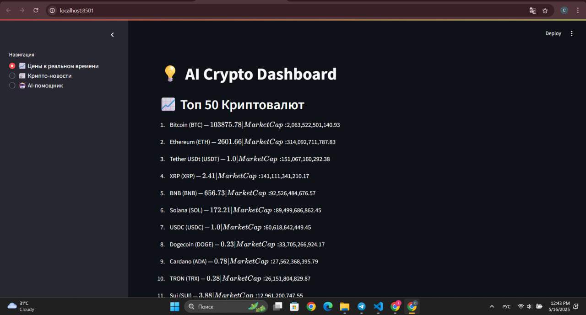

# AI Crypto Assistant

AI Crypto Assistant is an intelligent assistant for crypto market analysis, answering questions about the top 50 cryptocurrencies using up-to-date data and news.

## Demo Screenshots

| Real-time Prices | Crypto News | AI Assistant | Comparison |
|:---:|:---:|:---:|:---:|
|  |  |  |  |

| Coin Details & News | Investment Advice | More Features |
|:---:|:---:|:---:|
|  |  |  |

## Features
- Get price, market cap, rank, and description for the top 50 coins (CoinGecko/CoinMarketCap API)
- Semantic news search for cryptocurrencies (Cointelegraph RSS + Ollama embeddings)
- Compare coins by price, market cap, and rank
- Historical price and market cap data
- Supports queries in English and Russian, e.g.:
  — “What’s the price of Solana?”  
  — “Latest news about Ethereum”  
  — “Compare Ethereum and Cardano”  
  — “Should I invest in Dogecoin?”
- Markdown-formatted output with source links and concise explanations

## Quick Start
1. Clone the repository:
   ```powershell
   git clone https://github.com/YOUR-USERNAME/REPO-NAME.git
   cd REPO-NAME
   ```
2. Install dependencies:
   ```powershell
   pip install -r requirements.txt
   ```
3. Set up your `.env` file (example):
   ```env
   COINGECKO_API_KEY=your_key
   COINMARKETCAP_API_KEY=your_key
   # ... other keys if needed
   ```
4. Run Ollama with the llama3.2 model locally (https://ollama.com/):
   ```powershell
   ollama run llama3.2
   ```
5. Start the app:
   ```powershell
   streamlit run app.py
   ```

## Project Structure
- `app.py` — main Streamlit app
- `ai/response_gen.py` — response generation, query handling, LLM calls
- `apis/prices.py`, `apis/coinmarketcap.py` — price and market data
- `apis/news.py` — semantic news search and processing

## Important
- Do not store real API keys in the repository! Use `.env` and add it to `.gitignore`.
- Semantic news search requires a local Ollama instance.

---

**Author:** Tomiris Tapen , Ayaulym Kenzhekul
